# python

## 1.基础语法

### 1.1.Python 标识符

所有标识符可以包括英文、数字以及下划线(_)，但不能以数字开头。  

标识符是区分大小写的。  

以下划线开头的标识符是有特殊意义的。以单下划线开头 _foo 的代表不能直接访问的类属性，需通过类提供的接口进行访问，不能用 from xxx import * 而导入。  

以双下划线开头的 __foo 代表类的私有成员.  

以双下划线开头和结尾的 __foo__ 代表 Python 里特殊方法专用的标识，如 __init__() 代表类的构造函数。  

Python 可以同一行显示多条语句，方法是用分号 ; 分开  

```py
print ('hello');print ('runoob');
```

### 1.2. Python 保留字符

这些保留字不能用作常数或变数，或任何其他标识符名称。  

所有 Python 的关键字只包含小写字母。

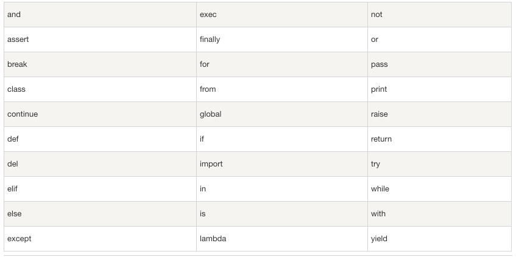

### 1.3. 行和缩进

Python 的代码块不使用大括号 {} 来控制类，函数以及其他逻辑判断。python 最具特色的就是用缩进来写模块。  

缩进的空白数量是可变的，但是所有代码块语句必须包含相同的缩进空白数量，这个必须严格执行。  

以下实例缩进为四个空格:

```py
if True:
    print ("True")
else:
    print ("False")
```

### 1.4. 多行语句

Python语句中一般以新行作为语句的结束符。  

可以使用斜杠（ \）将一行的语句分为多行显示，如下所示：  

```py
total = item_one + \
        item_two + \
        item_three
```

语句中包含 [], {} 或 () 括号就不需要使用多行连接符。如下实例：

```py
days = ['Monday', 'Tuesday', 'Wednesday',
        'Thursday', 'Friday']
```

### 1.5. Python 引号

python 可以使用引号( ' )、双引号( " )、三引号( ''' 或 """ ) 来表示字符串，引号的开始与结束必须是相同类型的。  

其中三引号可以由多行组成，编写多行文本的快捷语法，常用于文档字符串，在文件的特定地点，被当做注释。

```py
word = 'word'
sentence = "这是一个句子。"
paragraph = """这是一个段落。
包含了多个语句"""
```

### 1.6. Python注释

单行注释采用 # 开头。  

```py
# 第一个注释
print ("Hello, Python!")  # 第二个注释
```

python 中多行注释使用三个单引号(''')或三个双引号(""")。  

```py
'''
这是多行注释，使用单引号。
这是多行注释，使用单引号。
这是多行注释，使用单引号。
'''

"""
这是多行注释，使用双引号。
这是多行注释，使用双引号。
这是多行注释，使用双引号。
"""
```

### 1.7. Python空行

函数之间或类的方法之间用空行分隔，表示一段新的代码的开始。  

类和函数入口之间也用一行空行分隔，以突出函数入口的开始。  

空行与代码缩进不同，空行并不是Python语法的一部分。书写时不插入空行，Python解释器运行也不会出错。但是空行的作用在于分隔两段不同功能或含义的代码，便于日后代码的维护或重构。  

记住：空行也是程序代码的一部分。  

### 1.8. 等待用户输入

\n 实现换行。一旦用户按下 enter(回车) 键退出，其它键显示。

```py
raw_input("按下 enter 键退出，其他任意键显示...\n")
```

### 1.9. 同一行显示多条语句

Python可以在同一行中使用多条语句，语句之间使用分号(;)分割

```py
import sys; x = 'runoob'; sys.stdout.write(x + '\n')
```

### 1.10. print 输出

print 默认输出是换行的，如果要实现不换行需要在变量末尾加上逗号.  

```py
x="a"
y="b"
# 换行输出
print x
print y

print '---------'
# 不换行输出
print x,
print y,

# 不换行输出
print x,y
```

### 1.11. 多个语句构成代码组

缩进相同的一组语句构成一个代码块，我们称之代码组。  

像if、while、def和class这样的复合语句，首行以关键字开始，以冒号( : )结束，该行之后的一行或多行代码构成代码组。  

```py
if expression : 
   suite 
elif expression :  
   suite  
else :  
   suite
```

### 1.12. 命令行参数

很多程序可以执行一些操作来查看一些基本信息，Python 可以使用 -h 参数查看各参数帮助信息：

```text
$ python -h 
usage: python [option] ... [-c cmd | -m mod | file | -] [arg] ... 
Options and arguments (and corresponding environment variables): 
-c cmd : program passed in as string (terminates option list) 
-d     : debug output from parser (also PYTHONDEBUG=x) 
-E     : ignore environment variables (such as PYTHONPATH) 
-h     : print this help message and exit 
```

## 2. Python 变量类型

### 2.1. 变量赋值

(demo/demo1.py)  

```py
counter = 100; # 赋值整型变量
miles = 1000.0; # 浮点型
name = "John"; # 字符串

print(counter)
print(miles)
print(name)
```

### 2.2. 多个变量赋值

```py
# 多个变量赋值
a = b = c = 1
print(a,b,c) # 1,1,1

a, b, c = 1, 2, "john"
print(a,b,c) # 1 2 john
```

### 2.3. 标准数据类型

有五个标准的数据类型：

- Numbers（数字）
- String（字符串）
- List（列表）
- Tuple（元组）
- Dictionary（字典）

#### 2.3.1. Python 数字

(demos/type/number.py)  

Python支持四种不同的数字类型：

- 整型(Int) - 通常被称为是整型或整数，是正或负整数，不带小数点。
- 长整型(long integers) - 无限大小的整数，整数最后是一个大写或小写的L。
- 浮点型(floating point real values) - 浮点型由整数部分与小数部分组成，浮点型也可以使用科学计数法表示（2.5e2 = 2.5 x 10^2 = 250）
- 复数(complex numbers) - 复数由实数部分和虚数部分构成，可以用a + bj,或者complex(a,b)表示， 复数的实部a和虚部b都是浮点型。

##### Number 类型转换

int(x [,base ])         将x转换为一个整数  
long(x [,base ])        将x转换为一个长整数  
float(x )               将x转换到一个浮点数  
complex(real [,imag ])  创建一个复数  
str(x )                 将对象 x 转换为字符串  
repr(x )                将对象 x 转换为表达式字符串  
eval(str )              用来计算在字符串中的有效Python表达式,并返回一个对象  
tuple(s )               将序列 s 转换为一个元组  
list(s )                将序列 s 转换为一个列表  
chr(x )                 将一个整数转换为一个字符  
unichr(x )              将一个整数转换为Unicode字符  
ord(x )                 将一个字符转换为它的整数值  
hex(x )                 将一个整数转换为一个十六进制字符串  
oct(x )                 将一个整数转换为一个八进制字符串  

##### math 模块、cmath 模块

Python math 模块提供了许多对浮点数的数学运算函数。  

Python cmath 模块包含了一些用于复数运算的函数。  

要使用 math 或 cmath 函数必须先导入：  

```py
import cmath

print(cmath.sqrt(-1))
print(cmath.sqrt(9))
print(cmath.sin(1))
print(cmath.log10(100))

# 1j
# (3+0j)
# (0.8414709848078965+0j)
# (2+0j)
```

##### 数学函数

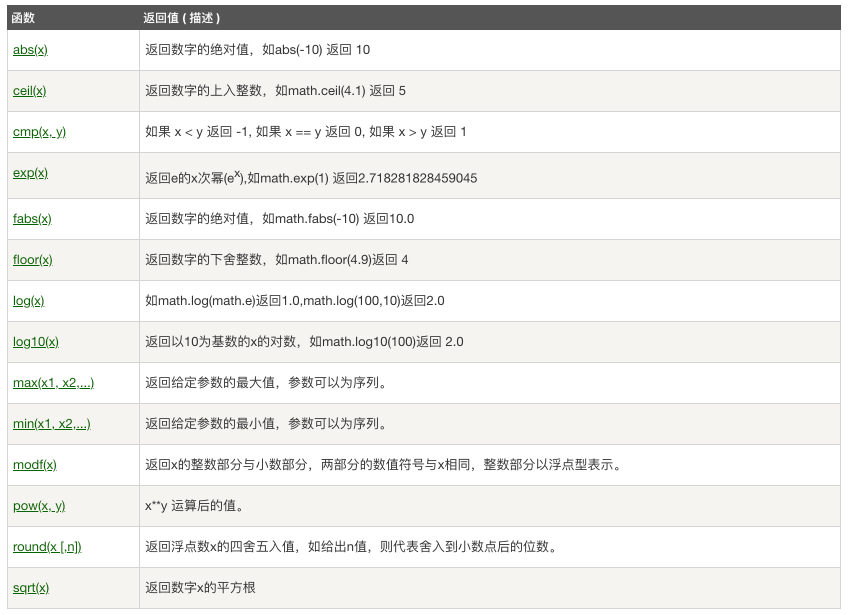

##### Python随机数函数

随机数可以用于数学，游戏，安全等领域中，还经常被嵌入到算法中，用以提高算法效率，并提高程序的安全性。  

Python包含以下常用随机数函数：  

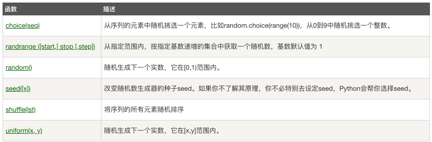

##### Python三角函数

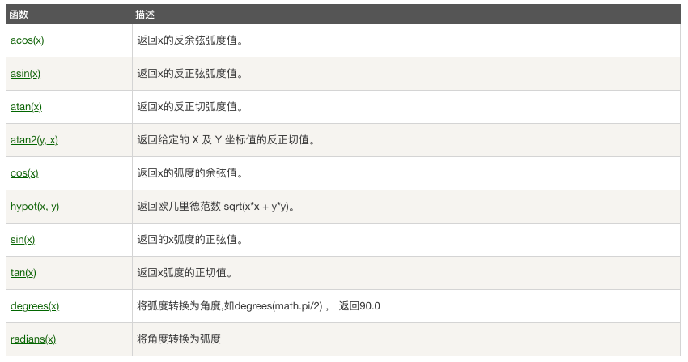

##### Python数学常量

pi —— 数学常量 pi（圆周率，一般以π来表示）。  
e —— 数学常量 e，e即自然常数（自然常数）。  

#### 2.3.2. Python字符串

(demo/type/string.py)  

字符串或串(String)是由数字、字母、下划线组成的一串字符。  

python的字串列表有2种取值顺序:  

- 从左到右索引默认0开始的，最大范围是字符串长度少1
- 从右到左索引默认-1开始的，最大范围是字符串开头  

如果你要实现从字符串中获取一段子字符串的话，可以使用 [头下标:尾下标] 来截取相应的字符串，其中下标是从 0 开始算起，可以是正数或负数，下标可以为空表示取到头或尾。  

[头下标:尾下标] 获取的子字符串包含头下标的字符，但不包含尾下标的字符。  

```py
s = 'abcdef'
s[1:5] #'bcde'
```

加号（+）是字符串连接运算符，星号（*）是重复操作。

```py
str = 'Hello World!'
 
print(str * 2)       # 输出字符串两次 Hello World!Hello World!
print(str + "TEST")  # 输出连接的字符串 Hello World!TEST
```

Python 列表截取可以接收第三个参数，参数作用是截取的步长.  
以下在索引 1 到索引 4 的位置并设置为步长为 2（间隔一个位置）来截取字符串：  

```py
str = 'Hello World!'
print(str[2:5:2])      # lo
```

##### 转义字符

在需要在字符中使用特殊字符时，python 用反斜杠 \ 转义字符。如下表：  

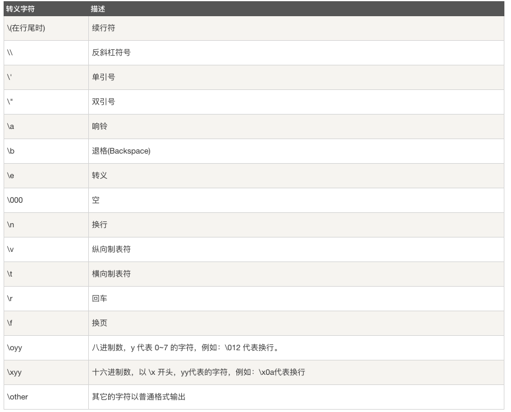

##### 字符串运算符

下表实例变量 a 值为字符串 "Hello"，b 变量值为 "Python"：  

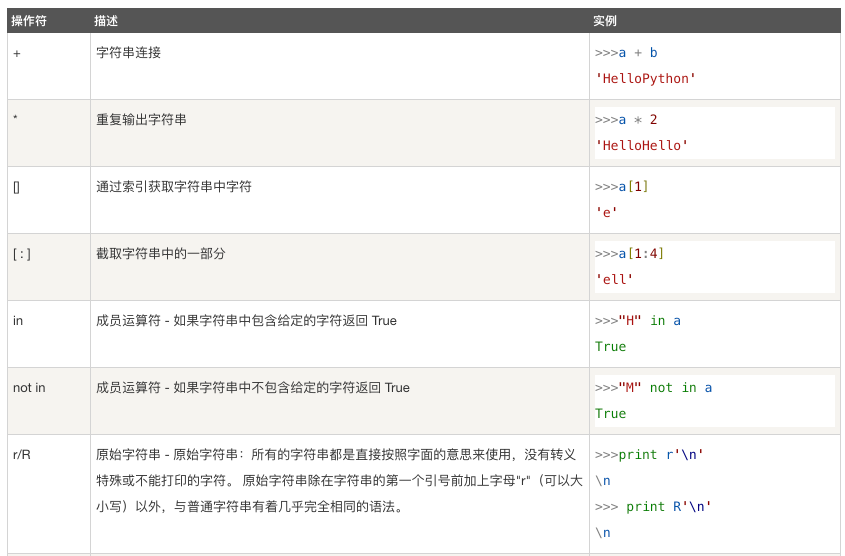

##### 字符串格式化

将一个值插入到一个有字符串格式符 %s 的字符串中。  

```py
print("My name is %s and weight is %d kg!" % ('Zara', 21))
# My name is Zara and weight is 21 kg!
```

python 字符串格式化符号:  

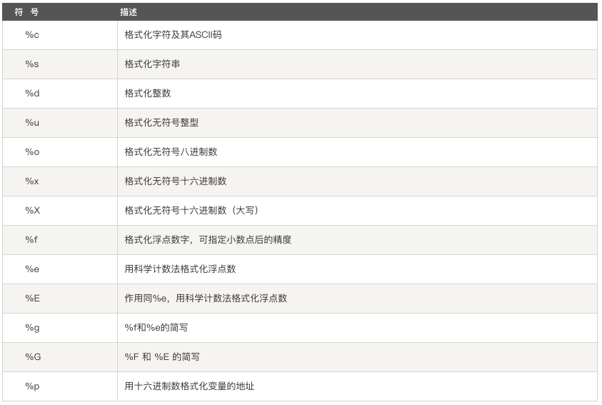

格式化操作符辅助指令:

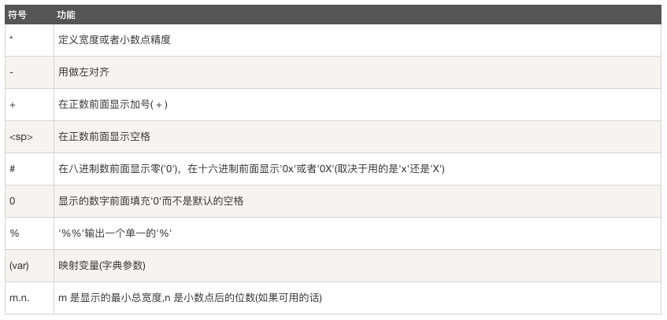

##### 三引号

三引号可以将复杂的字符串进行赋值。  

三引号允许一个字符串跨多行，字符串中可以包含换行符、制表符以及其他特殊字符。  

三引号的语法是一对连续的单引号或者双引号（通常都是成对的用）。  

```py
hi = '''hi 
there'''
print(hi)

# hi 
# there
```

##### Unicode 字符串

引号前小写的"u"表示这里创建的是一个 Unicode 字符串。如果你想加入一个特殊字符，可以使用 Python 的 Unicode-Escape 编码。如下例所示：

```py
print(u'Hello World !')       # Hello World !
print(u'Hello\u0020World !')  # Hello World !s
```

##### 字符串内建函数

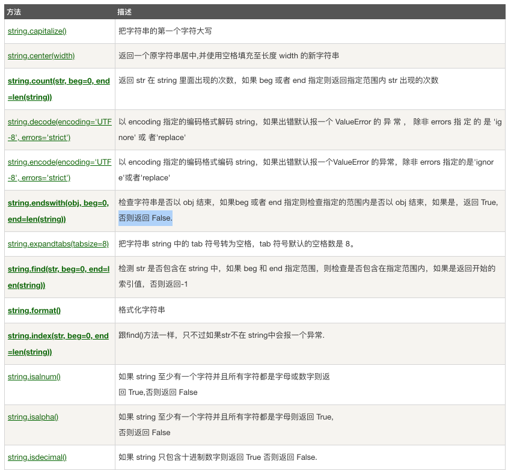
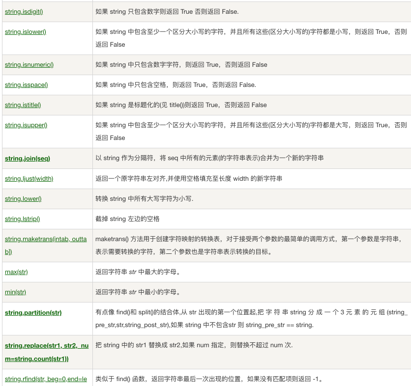
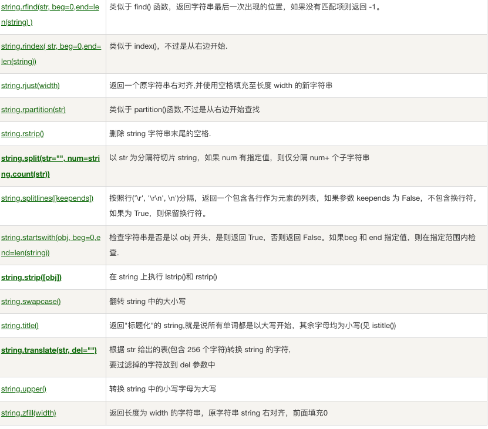

#### 2.3.3. Python列表

(demo/type/list.py)  

列表用 [ ] 标识, 列表可以完成大多数集合类的数据结构实现。它支持字符，数字，字符串甚至可以包含列表（即嵌套）。

列表中值的切割也可以用到变量 [头下标:尾下标] ，就可以截取相应的列表，从左到右索引默认 0 开始，从右到左索引默认 -1 开始，下标可以为空表示取到头或尾。  

加号 + 是列表连接运算符，星号 * 是重复操作

```py
list = [ 'runoob', 786 , 2.23, 'john', 70.2 ]
tinylist = [123, 'john']
 
print(list)                # 输出完整列表 ['runoob', 786, 2.23, 'john', 70.2]
print(list[0])             # 输出列表的第一个元素 runoob
print(list[1:3])           # 输出第二个至第三个元素  [786, 2.23]
print(list[2:])            # 输出从第三个开始至列表末尾的所有元素 [2.23, 'john', 70.2]
print(tinylist * 2)        # 输出列表两次 [123, 'john', 123, 'john']
print(list + tinylist)     # 打印组合的列表 ['runoob', 786, 2.23, 'john', 70.2, 123, 'john']
```

##### 更新列表

使用append()方法来添加列表项  

```py
list = []  # 空列表
list.append('Google')  # 使用 append() 添加元素
list.append('Runoob')
print(list) # ['Google', 'Runoob']
```

##### 删除列表元素

使用 del 语句来删除列表的元素

```py
list1 = ['physics', 'chemistry', 1997, 2000]

del list1[2]
print(list1) # ['physics', 'chemistry', 2000]
```

##### 列表脚本操作符

+号用于组合列表，*号用于重复列表。  

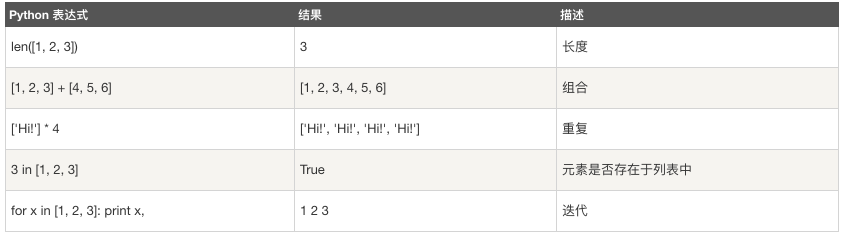

##### 列表函数&方法

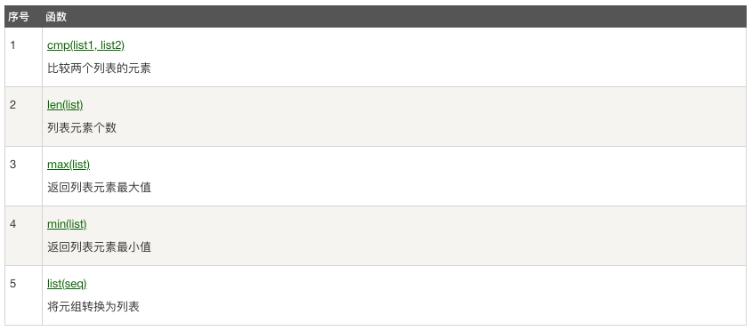
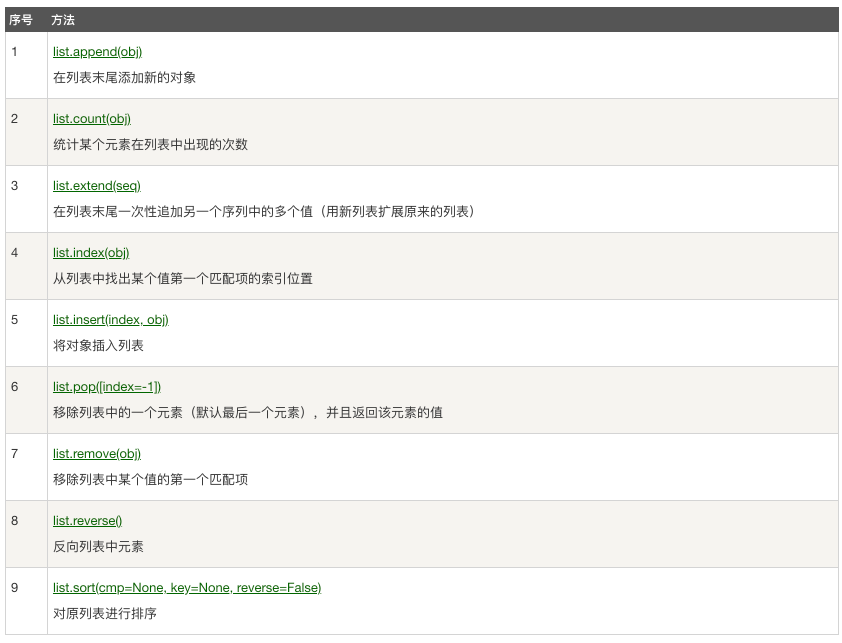

python 3.4.3 的版本中已经没有cmp函数，被operator模块代替，在交互模式下使用时，需要导入模块。  

```py
import operator              #首先要导入运算符模块
print(operator.gt(1,2))  # False    #意思是greater than（大于）
print(operator.ge(1,2))  # False    #意思是greater and equal（大于等于）
print(operator.eq(1,2))  # False    #意思是equal（等于）
print(operator.le(1,2))  # True     #意思是less and equal（小于等于）
print(operator.lt(1,2))  # True     #意思是less than（小于）
```

#### 2.3.4. Python 元组

(demos/type/tup.py)  

元组是另一个数据类型，类似于 List（列表）。  
元组用 () 标识。内部元素用逗号隔开。但是元组不能二次赋值，相当于只读列表。

```py
tuple = ( 'runoob', 786 , 2.23, 'john', 70.2 )
tinytuple = (123, 'john')
 
print(tuple)                # 输出完整元组 ('runoob', 786, 2.23, 'john', 70.2)
print(tuple[0])             # 输出元组的第一个元素 runoob
print(tuple[1:3])           # 输出第二个至第四个（不包含）的元素 (786, 2.23)
print(tuple[2:])            # 输出从第三个开始至列表末尾的所有元素 (2.23, 'john', 70.2)
print(tinytuple * 2)        # 输出元组两次 (123, 'john', 123, 'john')
print(tuple + tinytuple)    # 打印组合的元组 ('runoob', 786, 2.23, 'john', 70.2, 123, 'john')
```

创建空元组  

```py
tup1 = ()
```

元组中只包含一个元素时，需要在元素后面添加逗号

```py
tup1 = (50,)
```

##### 访问元组

元组可以使用下标索引来访问元组中的值

```py
tup1 = ('physics', 'chemistry', 1997, 2000)
tup2 = (1, 2, 3, 4, 5, 6, 7)

print(tup1[0])    # physics
print(tup2[1:5])  # (2, 3, 4, 5)
```

##### 修改元组

元组中的元素值是不允许修改的，但我们可以对元组进行连接组合

```py
tup3 = tup1 + tup2
print(tup3) # ('physics', 'chemistry', 1997, 2000, 1, 2, 3, 4, 5, 6, 7)
```

##### 删除元组

元组中的元素值是不允许删除的，但我们可以使用del语句来删除整个元组

元组被删除后，输出变量会有异常信息，输出如下所示：NameError: name 'tup' is not defined

##### 元组运算符

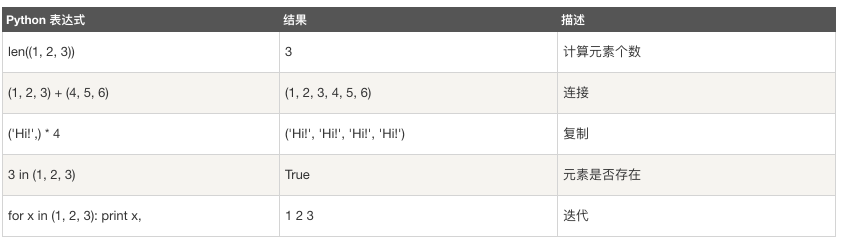

#### 元组内置函数

len(tuple) 计算元组元素个数。  
max(tuple) 返回元组中元素最大值。  
min(tuple) 返回元组中元素最小值。  
tuple(seq) 将列表转换为元组。  

#### 2.3.5. Python 字典

(demo/demo5.py)  

字典(dictionary)是除列表以外python之中最灵活的内置数据结构类型。列表是有序的对象集合，字典是无序的对象集合。  

两者之间的区别在于：字典当中的元素是通过键来存取的，而不是通过偏移存取。  

字典用"{ }"标识。字典由索引(key)和它对应的值value组成。  

```py
dict = {}
dict['one'] = "This is one"
dict[2] = "This is two"

tinydict = {'name': 'runoob', 'code': 6734, 'dept': 'sales'}

print(dict['one'])  # 输出键为'one' 的值  #This is one
print(dict[2])  # 输出键为 2 的值  #This is two
print(tinydict)  # 输出完整的字典  #{'name': 'runoob', 'code': 6734, 'dept': 'sales'}
print(tinydict.keys())  # 输出所有键  #dict_keys(['name', 'code', 'dept'])
print(tinydict.values())  # 输出所有值  #dict_values(['runoob', 6734, 'sales'])
```

##### 访问字典里的值

把相应的键放入熟悉的方括弧

```py
dict = {'Name': 'Zara', 'Age': 7, 'Class': 'First'}
 
print ("dict['Name']: ", dict['Name'])  # dict['Name']:  Zara
```

##### 修改字典

向字典添加新内容的方法是增加新的键/值对，修改或删除已有键/值对

```py
dict['Age'] = 8 # 更新
dict['School'] = "RUNOOB" # 添加
 
print( "dict['Age']: ", dict['Age'])        # dict['Age']:  8
print( "dict['School']: ", dict['School'])  # dict['School']:  RUNOOB
```

##### 删除字典元素

能删单一的元素也能清空字典

```py
dict = {'Name': 'Zara', 'Age': 7, 'Class': 'First'}
 
del dict['Name']    # 删除键是'Name'的条目  {'Age': 7, 'Class': 'First'}
dict.clear()        # 清空字典所有条目       {}
del dict            # 删除字典              <class 'dict'>
```

##### 字典键的特性

1. 不允许同一个键出现两次。创建时如果同一个键被赋值两次，后一个值会被记住

```py
dict = {'Name': 'Zara', 'Age': 7, 'Name': 'Manni'} 
print(dict['Name']) # Manni
```

2. 键必须不可变，所以可以用数字，字符串或元组充当

```py
dict = {['Name']: 'Zara', 'Age': 7} 
 
print (dict['Name']) # TypeError unhashable type: 'list'
```

##### 字典内置函数&方法

内置函数：  

len(dict) 计算字典元素个数，即键的总数。  
str(dict) 输出字典可打印的字符串表示。  
type(variable) 返回输入的变量类型，如果变量是字典就返回字典类型。

内置方法:

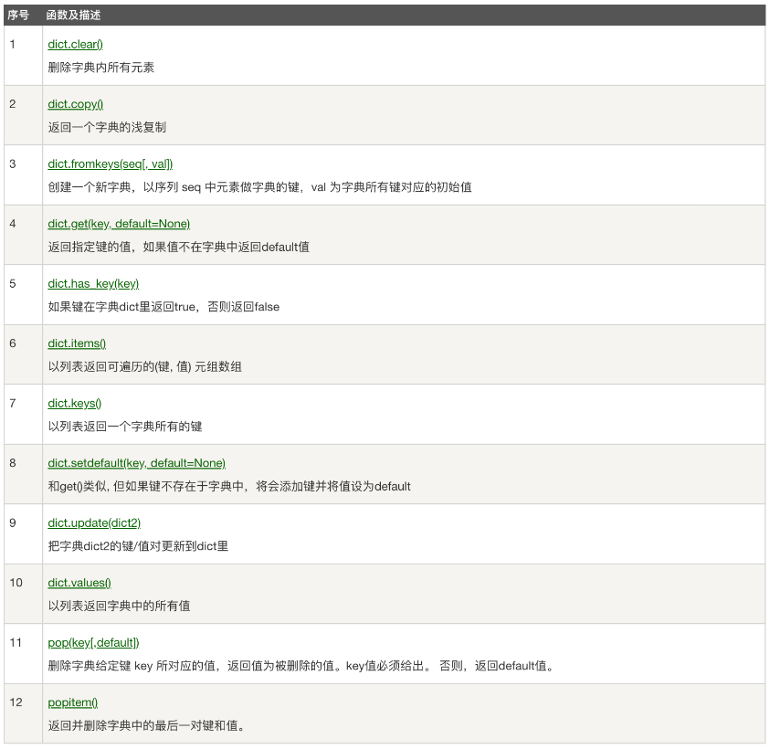

Python3没有dict.has_key方法, 用in  

#### 2.3.6. Python数据类型转换

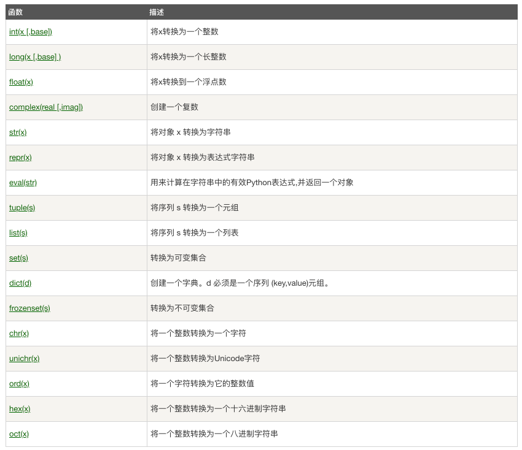

## 3. Python 运算符

### 3.1. Python算术运算符

(demo/demo6.py)  

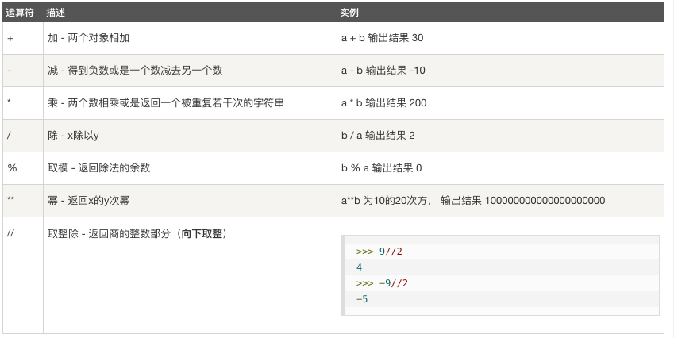

```py
a = 2
b = 3
c = a**b 
print("c 的值为：", c)
 
a = 10
b = 5
c = a//b 
print("c 的值为：", c)
```

### 3.2. Python比较运算符

(demo/demo7.py)  

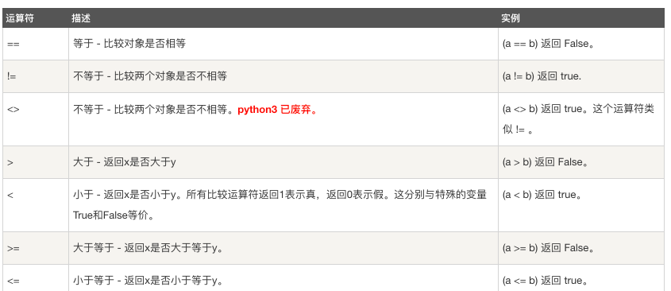

### 3.3. Python赋值运算符

(demo/demo8.py)  

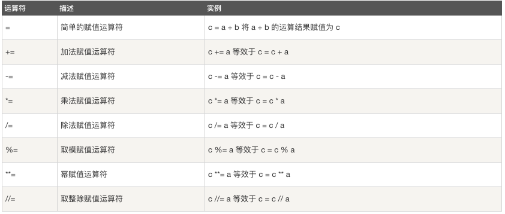

### 3.4. Python位运算符

(demo/demo9.py)  

按位运算符是把数字看作二进制来进行计算的.  

![赋值运算符]

### 3.5. Python逻辑运算符

(demo/demo10.py)  

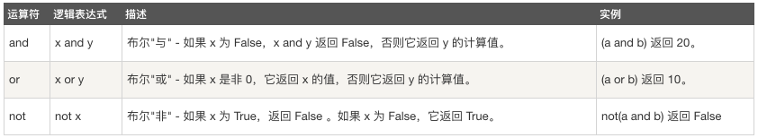

```py
a = 10
b = 20

print("a and b", a and b) # 20

print("a or b", a or b) # 10

print("not b", not a) # False
```

### 3.6. Python成员运算符

(demo/demo11.py)  

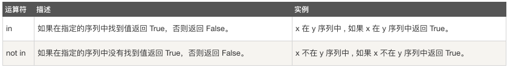

```py
a = 10
b = 20
list = [1, 2, 3, 4, 5]

print("a in list", a in list)               # False
print("b not in list", b not in list)       # True
```

### 3.7. Python身份运算符

(demo/demo12.py)  

身份运算符用于比较两个对象的存储单元  

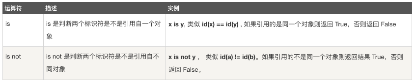

```py
a = 20
b = 20

print("a is b", a is b)             #  True
print("a is not b", a is not b)     #  False
```

### 3.8. Python运算符优先级

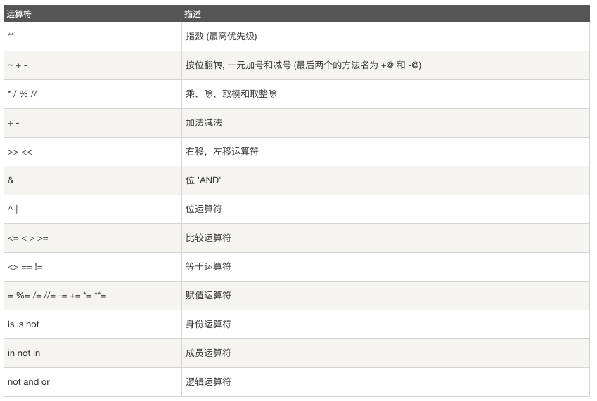

## 4. Python 条件语句

(demo/demo13.py)  

if 语句用于控制程序的执行，基本形式为：  

```text
if 判断条件：
    执行语句……
else：
    执行语句……
```

```py
flag = False
name = 'luren'
if name == 'python':  # 判断变量是否为 python
    flag = True  # 条件成立时设置标志为真
    print('welcome')  # 并输出欢迎信息
else:
    print(name)  # 条件不成立时输出变量名称
```

当判断条件为多个值时，可以使用以下形式：  

```text
if 判断条件1:
    执行语句1……
elif 判断条件2:
    执行语句2……
elif 判断条件3:
    执行语句3……
else:
    执行语句4……
```

```py
num = 5
if num == 3:  # 判断num的值
    print('boss')
elif num == 2:
    print('user')
elif num == 1:
    print('worker')
elif num < 0:  # 值小于零时输出
    print('error')
else:
    print('roadman')  # 条件均不成立时输出
```

如果判断需要多个条件需同时判断时，可以使用 or （或），表示两个条件有一个成立时判断条件成功；使用 and （与）时，表示只有两个条件同时成立的情况下，判断条件才成功。  

```py
num = 9
if num >= 0 and num <= 10:  # 判断值是否在0~10之间
    print('hello')
# 输出结果: hello
num = 10
if num < 0 or num > 10:  # 判断值是否在小于0或大于10
    print('hello')
else:
    print('undefine')
# 输出结果: undefine

num = 8
# 判断值是否在0~5或者10~15之间
if (num >= 0 and num <= 5) or (num >= 10 and num <= 15):
    print('hello')
else:
    print('undefine')
# 输出结果: undefine
```

可以在同一行的位置上使用if条件判断语句

```py
var = 100
if (var == 100): print("变量 var 的值为100")
```

## 5. Python 循环语句

(demos/demo14.py)  

Python 提供了 for 循环和 while 循环（在 Python 中没有 do..while 循环）。  

while 循环——在给定的判断条件为 true 时执行循环体，否则退出循环体。  
for 循环——重复执行语句。  
嵌套循环——你可以在while循环体中嵌套for循环。  

循环控制语句可以更改语句执行的顺序。Python支持以下循环控制语句。  

break 语句——在语句块执行过程中终止循环，并且跳出整个循环。  
continue 语句——在语句块执行过程中终止当前循环，跳出该次循环，执行下一次循环。  
pass 语句——pass是空语句，是为了保持程序结构的完整性。  

### 5.1. While 循环语句

其基本形式为：

```text
while 判断条件(condition)：
    执行语句(statements)……
```

```py
count = 0
while (count < 9):
    print('The count is:', count)
    count = count + 1

print("Good bye!")
```

while 语句时还有另外两个重要的命令 continue，break 来跳过循环，continue 用于跳过该次循环，break 则是用于退出循环，此外"判断条件"还可以是个常值，表示循环必定成立，具体用法如下：  

```py
i = 1
while i < 10:
    i += 1
    if i % 2 > 0:  # 非双数时跳过输出
        continue
    print(i)  # 输出双数2、4、6、8、10

i = 1
while 1:  # 循环条件为1必定成立
    print(i)  # 输出1~10
    i += 1
    if i > 10:  # 当i大于10时跳出循环
        break
```

#### 5.1.1. 无限循环

如果条件判断语句永远为 true，循环将会无限的执行下去

```py
var = 1
while var == 1 :  # 该条件永远为true，循环将无限执行下去
   num = raw_input("Enter a number  :")
   print ("You entered: ", num)
 
print ("Good bye!")
```

#### 5.1.2. 循环使用 else 语句

在 python 中，while … else 在循环条件为 false 时执行 else 语句块：

```py
count = 0
while count < 5:
    print(count, " is  less than 5")
    count = count + 1
else:
    print(count, " is not less than 5")
```

#### 5.1.3. 简单语句组

如果你的 while 循环体中只有一条语句，你可以将该语句与while写在同一行中

```py
flag = 1
while (flag): print ('Given flag is really true!')
print ("Good bye!")
```

### 5.2. for 循环语句

for循环的语法格式如下：

```text
for iterating_var in sequence:
   statements(s)
```

```py
for letter in 'Python': 
    print('当前字母 :', letter)

fruits = ['banana', 'apple', 'mango']
for fruit in fruits: 
    print('当前水果 :', fruit)
```

#### 5.2.1. 通过序列索引迭代

```py
fruits = ['banana', 'apple',  'mango']
for index in range(len(fruits)):
   print ('当前水果 :', fruits[index])
```

#### 5.2.2. 循环使用 else 语句

for 中的语句和普通的没有区别，else 中的语句会在循环正常执行完（即 for 不是通过 break 跳出而中断的）的情况下执行，while … else 也是一样。  

```py
for num in range(10, 20):  # 迭代 10 到 20 之间的数字
    for i in range(2, num):  # 根据因子迭代
        if num % i == 0:  # 确定第一个因子
            j = num / i  # 计算第二个因子
            print('%d 等于 %d * %d' % (num, i, j))
            break  # 跳出当前循环
    else:  # 循环的 else 部分
        print(num, '是一个质数')
```

### 5.3. 循环嵌套

Python for 循环嵌套语法：

```text
for iterating_var in sequence:
   for iterating_var in sequence:
      statements(s)
   statements(s)
```

Python while 循环嵌套语法：

```text
while expression:
   while expression:
      statement(s)
   statement(s)
```

```py
# 嵌套循环输出2~100之间的素数：
i = 2
while (i < 100):
    j = 2
    while (j <= (i / j)):
        if not (i % j): break
        j = j + 1
    if (j > i / j): print(i, " 是素数")
    i = i + 1
```

### 5.4. break 语句

break语句用来终止循环语句，即循环条件没有False条件或者序列还没被完全递归完，也会停止执行循环语句。

```py
for letter in 'Python':
    if letter == 'h':
        break
    print('当前字母 :', letter)
# 当前字母 : P
# 当前字母 : y
# 当前字母 : t
```

### 5.5. continue 语句

continue 语句用来告诉Python跳过当前循环的剩余语句，然后继续进行下一轮循环。  

continue语句用在while和for循环中。  

```py
for letter in 'Python':
    if letter == 'h':
        continue
    print('当前字母 :', letter)
# 当前字母 : P
# 当前字母 : y
# 当前字母 : t
# 当前字母 : o
# 当前字母 : n
```

## 6. pass语句

(demos/demo15.py)  

Python pass 是空语句，是为了保持程序结构的完整性。  

pass 不做任何事情，一般用做占位语句。  

```py
for letter in 'Python':
    if letter == 'h':
        pass
        print('这是 pass 块')
    print('当前字母 :', letter)
# 当前字母 : P
# 当前字母 : y
# 当前字母 : t
# 这是 pass 块
# 当前字母 : h
# 当前字母 : o
# 当前字母 : n
```

## 7. 日期和时间

(demos/demo16.py)  

Python 提供了一个 time 和 calendar 模块可以用于格式化日期和时间。  

时间间隔是以秒为单位的浮点小数。  

每个时间戳都以自从1970年1月1日午夜（历元）经过了多长时间来表示。  

Python 的 time 模块下有很多函数可以转换常见日期格式。如函数time.time()用于获取当前时间戳.  

```py
import time  # 引入time模块
ticks = time.time()
print(ticks)  # 1607665703.6253812
```

### 时间元组

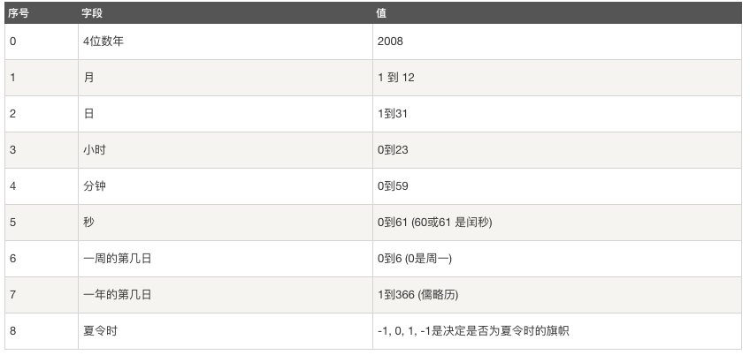
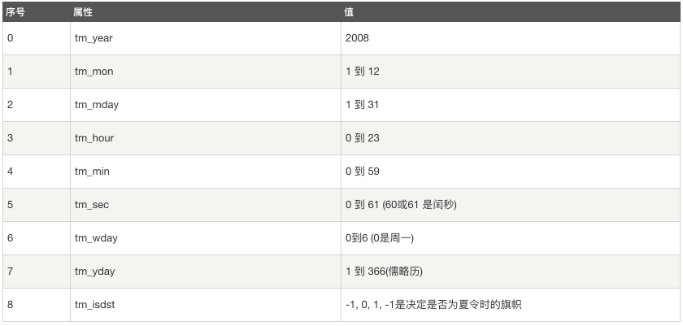

### 获取当前时间

从返回浮点数的时间戳方式向时间元组转换，只要将浮点数传递给如localtime之类的函数。

```py
import time
localtime = time.localtime(time.time())
print("本地时间为 :", localtime) # 本地时间为 : time.struct_time(tm_year=2020, tm_mon=12, tm_mday=11, tm_hour=14, tm_min=0, tm_sec=46, tm_wday=4, tm_yday=346, tm_isdst=0)
```

### 获取格式化的时间

最简单的获取可读的时间模式的函数是asctime():

```py
import time
localtime = time.asctime(time.localtime(time.time()))
print("本地时间为 :", localtime) # 地时间为 : Fri Dec 11 14:04:49 2020
```

### 格式化日期

使用 time 模块的 strftime 方法来格式化日期

```py
import time
# 格式化成YYYY-MM-DD HH:mm:ss形式
print (time.strftime("%Y-%m-%d %H:%M:%S", time.localtime()) ) # 2020-12-11 14:09:10
```

python中时间日期格式化符号：  

%y 两位数的年份表示（00-99）  
%Y 四位数的年份表示（000-9999）  
%m 月份（01-12）  
%d 月内中的一天（0-31）  
%H 24小时制小时数（0-23）  
%I 12小时制小时数（01-12）  
%M 分钟数（00-59）  
%S 秒（00-59）  
%a 本地简化星期名称  
%A 本地完整星期名称  
%b 本地简化的月份名称  
%B 本地完整的月份名称  
%c 本地相应的日期表示和时间表示  
%j 年内的一天（001-366）  
%p 本地A.M.或P.M.的等价符  
%U 一年中的星期数（00-53）星期天为星期的开始  
%w 星期（0-6），星期天为星期的开始  
%W 一年中的星期数（00-53）星期一为星期的开始  
%x 本地相应的日期表示  
%X 本地相应的时间表示  
%Z 当前时区的名称  
%% %号本身  

### 获取某月日历

Calendar模块有很广泛的方法用来处理年历和月历

```py
import calendar
cal = calendar.month(2020, 12)
print(cal)

# December 2020
# Mo Tu We Th Fr Sa Su
#     1  2  3  4  5  6
#  7  8  9 10 11 12 13
# 14 15 16 17 18 19 20
# 21 22 23 24 25 26 27
# 28 29 30 31
```

### Time 模块

Time 模块包含了以下内置函数，既有时间处理的，也有转换时间格式的：  

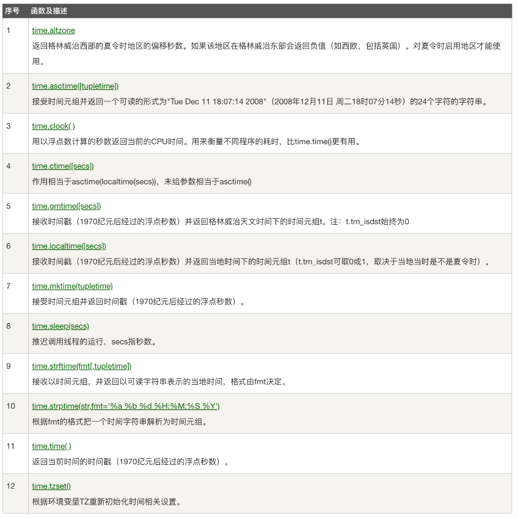

### 日历（Calendar）模块

星期一是默认的每周第一天，星期天是默认的最后一天。更改设置需调用calendar.setfirstweekday()函数。模块包含了以下内置函数：

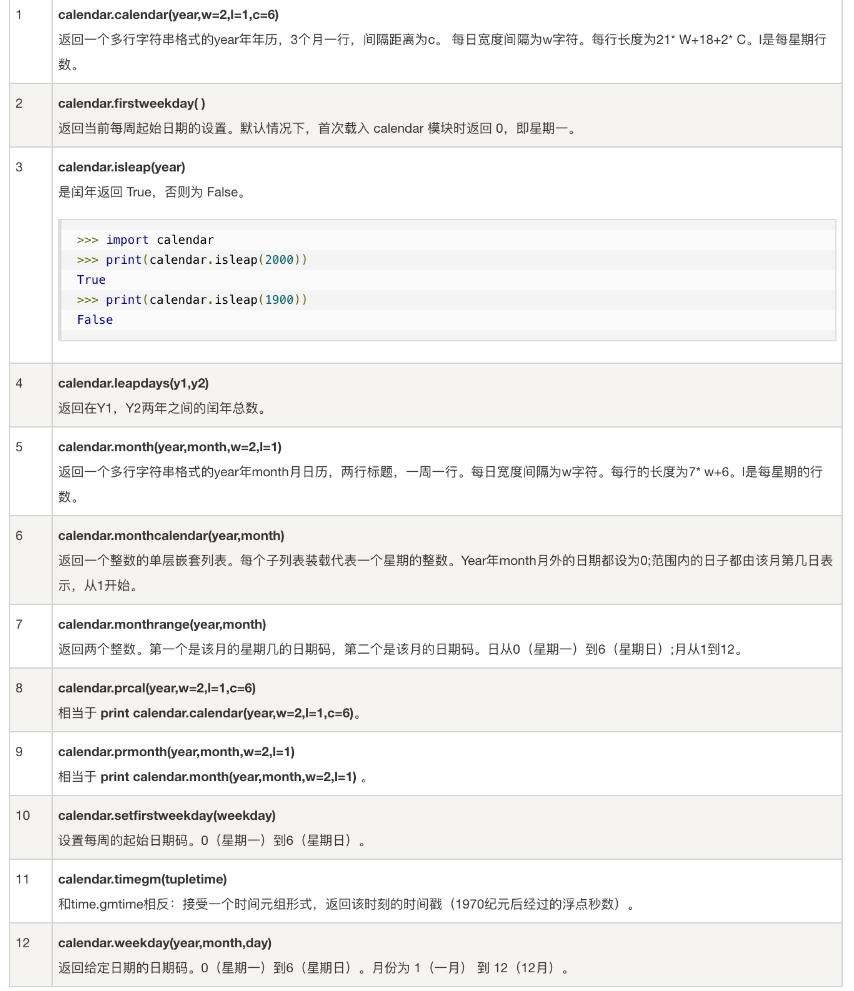

## 8. 函数

(demos/demo17.py)

### 8.1. 定义函数

函数代码块以 def 关键词开头，后接函数标识符名称和圆括号()。  
任何传入参数和自变量必须放在圆括号中间。圆括号之间可以用于定义参数。  
函数的第一行语句可以选择性地使用文档字符串—用于存放函数说明。  
函数内容以冒号起始，并且缩进。  
return [表达式] 结束函数，选择性地返回一个值给调用方。不带表达式的return相当于返回 None。  

语法

```text
def functionname( parameters ):
   "函数_文档字符串"
   function_suite
   return [expression]
```

### 8.2. 函数调用

定义一个函数只给了函数一个名称，指定了函数里包含的参数，和代码块结构。  

```py
# 定义函数
def printme(str):
    print(str)
    return

# 调用函数
printme("我要调用用户自定义函数!")
```

### 8.3. 参数传递

在 python 中，类型属于对象，变量是没有类型的.  

#### 可更改(mutable)与不可更改(immutable)对象

在 python 中，strings, tuples, 和 numbers 是不可更改的对象，而 list,dict 等则是可以修改的对象。  

**不可变类型**：变量赋值 a=5 后再赋值 a=10，这里实际是新生成一个 int 值对象 10，再让 a 指向它，而 5 被丢弃，不是改变a的值，相当于新生成了a。  

**可变类型**：变量赋值 la=[1,2,3,4] 后再赋值 la[2]=5 则是将 list la 的第三个元素值更改，本身la没有动，只是其内部的一部分值被修改了。  

python 函数的参数传递：  

**不可变类型**：类似 c++ 的值传递，如 整数、字符串、元组。如fun（a），传递的只是a的值，没有影响a对象本身。比如在 fun（a）内部修改 a 的值，只是修改另一个复制的对象，不会影响 a 本身。  

**可变类型**：类似 c++ 的引用传递，如 列表，字典。如 fun（la），则是将 la 真正的传过去，修改后fun外部的la也会受影响.  

```py
# python 传不可变对象实例
def ChangeInt(a):
    a = 10

b = 2
ChangeInt(b)
print(b)  # 结果是 2
# 实例中有 int 对象 2，指向它的变量是 b，在传递给 ChangeInt 函数时，按传值的方式复制了变量 b，a 和 b 都指向了同一个 Int 对象，在 a=10 时，则新生成一个 int 值对象 10，并让 a 指向它。
```

```py
# 传可变对象实例
# 可写函数说明
def changeme(mylist):
    "修改传入的列表"
    mylist.append([1, 2, 3, 4])
    print("函数内取值: ", mylist) # 函数内取值:  [10, 20, 30, [1, 2, 3, 4]]
    return

# 调用changeme函数
mylist = [10, 20, 30]
changeme(mylist)
print("函数外取值: ", mylist) # 函数外取值:  [10, 20, 30, [1, 2, 3, 4]]
# 实例中传入函数的和在末尾添加新内容的对象用的是同一个引用
```

### 8.4. 参数

调用函数时可使用的正式参数类型：

1. 必备参数
2. 关键字参数
3. 默认参数
4. 不定长参数

#### 8.4.1. 必备参数

必备参数须以正确的顺序传入函数。调用时的数量必须和声明时的一样。  

调用printme()函数，你必须传入一个参数，不然会出现语法错误：

```py
#可写函数说明
def printme( str ):
   "打印任何传入的字符串"
   print str
   return
 
#调用printme函数
printme()
```

#### 8.4.2. 关键字参数

函数调用使用关键字参数来确定传入的参数值。  

使用关键字参数允许函数调用时参数的顺序与声明时不一致，因为 Python 解释器能够用参数名匹配参数值。  

```py
def printinfo(name, age):
    print("Name:", name)
    print("Age:", age)
    return

printinfo(age=50, name="miki")  # Name: miki  Age: 50
```

#### 8.4.3. 默认参数

调用函数时，默认参数的值如果没有传入，则被认为是默认值。下例会打印默认的age，如果age没有被传入：  

```py
def printinfo(name, age=35):
    print("Name:", name, "Age:", age)
    return

#调用printinfo函数
printinfo(age=50, name="miki") # Name: miki Age: 50
printinfo(name="miki")         # Name: miki Age: 35
```

#### 8.4.4. 不定长参数

一个函数能处理比当初声明时更多的参数。这些参数叫做不定长参数,声明时不会命名。基本语法如下：

```text
def functionname([formal_args,] *var_args_tuple ):
   "函数_文档字符串"
   function_suite
   return [expression]
```

加了星号（*）的变量名会存放所有未命名的变量参数。  

```py
def printinfo(arg1, *vartuple):
    print(arg1)
    for var in vartuple:
        print(var)
    return


# 调用printinfo 函数  
printinfo(10)               # 10
printinfo(70, 60, 50)       # 70 60 50
```

### 8.5. 匿名函数

python 使用 lambda 来创建匿名函数。  

1. lambda只是一个表达式，函数体比def简单很多。
2. lambda的主体是一个表达式，而不是一个代码块。仅仅能在lambda表达式中封装有限的逻辑进去。
3. lambda函数拥有自己的命名空间，且不能访问自有参数列表之外或全局命名空间里的参数。
4. 虽然lambda函数看起来只能写一行，却不等同于C或C++的内联函数，后者的目的是调用小函数时不占用栈内存从而增加运行效率。  

#### 语法

lambda函数的语法只包含一个语句，如下：

```text
lambda [arg1 [,arg2,.....argn]]:expression
```

```py
sum = lambda arg1, arg2: arg1 + arg2

# 调用sum函数
print(sum(10, 20)) # 30
print(sum(20, 20)) # 40
```

### 8.6. 变量作用域

定义在函数内部的变量拥有一个局部作用域，定义在函数外的拥有全局作用域。  

- 全局变量
- 局部变量

```py
total = 0  # 这是一个全局变量


def sum(arg1, arg2):
    #返回2个参数的和."
    total = arg1 + arg2  # total在这里是局部变量.
    print("函数内是局部变量 : ", total)  # 30
    return total


#调用sum函数
sum(10, 20)
print("函数外是全局变量 : ", total)  # 0
```

## 9. 模块

(demos/module)

模块(Module)，是一个 Python 文件，以 .py 结尾，包含了 Python 对象定义和Python语句。  
把相关的代码分配到一个模块里能让你的代码更好用，更易懂。  
模块能定义函数，类和变量，模块里也能包含可执行的代码。  

### 9.1. import 语句

(demos/module/test.py)

一个模块只会被导入一次，不管你执行了多少次import。这样可以防止导入模块被一遍又一遍地执行。  

```text
import module1[, module2[,... moduleN]]
```

### 9.2. from…import 语句

python 的 from 语句让你从模块中导入一个指定的部分到当前命名空间中。语法如下：

```text
from modname import name1[, name2[, ... nameN]]
```

这个声明不会把整个 fib 模块导入到当前的命名空间中，它只会将 fib 里的 fibonacci 单个引入到执行这个声明的模块的全局符号表。

```py
from fib import fibonacci
```

### 9.3. from…import* 语句

把一个模块的所有内容全都导入到当前的命名空间.  

```text
from modname import *
```

想一次性引入 math 模块中所有的东西，语句如下：

```py
from math import *
```

### 9.4. 搜索路径

当你导入一个模块，Python 解析器对模块位置的搜索顺序是：  

1. 当前目录  
2. 如果不在当前目录，Python 则搜索在 shell 变量 PYTHONPATH 下的每个目录。  
3. 如果都找不到，Python会察看默认路径。UNIX下，默认路径一般为/usr/local/lib/python/。  

模块搜索路径存储在 system 模块的 sys.path 变量中。变量里包含当前目录，PYTHONPATH和由安装过程决定的默认目录。  

### 9.5. 命名空间和作用域

(demos/module/global.py)

一个 Python 表达式可以访问局部命名空间和全局命名空间里的变量。如果一个局部变量和一个全局变量重名，则局部变量会覆盖全局变量。  

每个函数都有自己的命名空间。类的方法的作用域规则和通常函数的一样。  

Python 会智能地猜测一个变量是局部的还是全局的，它假设任何在函数内赋值的变量都是局部的。  

因此，如果要给函数内的全局变量赋值，必须使用 global 语句。  

global VarName 的表达式会告诉 Python， VarName 是一个全局变量，这样 Python 就不会在局部命名空间里寻找这个变量了。  

### 9.6. dir()函数

(demos/module/dir.py)

dir() 函数一个排好序的字符串列表，内容是一个模块里定义过的名字。  
返回的列表容纳了在一个模块里定义的所有模块，变量和函数。  

```py
import math

content = dir(math)
print(content)
```

### 9.7. globals() 和 locals() 函数

根据调用地方的不同，globals() 和 locals() 函数可被用来返回全局和局部命名空间里的名字。  

如果在函数内部调用 locals()，返回的是所有能在该函数里访问的命名。  

如果在函数内部调用 globals()，返回的是所有在该函数里能访问的全局名字。  

两个函数的返回类型都是字典。所以名字们能用 keys() 函数摘取。  

### 9.8. reload() 函数

重新执行模块里顶层部分的代码，可以用 reload() 函数。该函数会重新导入之前导入过的模块.  

```py
reload(module_name)
```

### 9.9. Python中的包

包是一个分层次的文件目录结构，它定义了一个由模块及子包，和子包下的子包等组成的 Python 的应用环境。  

简单来说，包就是文件夹，但该文件夹下必须存在 __init__.py 文件, 该文件的内容可以为空。__init__.py 用于标识当前文件夹是一个包。  

## 10. 文件I/O

### 10.1. 读取键盘输入

(demos/IO/input.py)

input函数  

```py
str = input("请输入：")
print("你输入的内容是: ", str)
```

### 10.2. 打开和关闭文件

(demos/IO/file.py)  

Python 提供了必要的函数和方法进行默认情况下的文件基本操作。你可以用 file 对象做大部分的文件操作。

#### 10.2.1. open 函数

语法：

```text
file object = open(file_name [, access_mode][, buffering])
```

- file_name：file_name变量是一个包含了你要访问的文件名称的字符串值。
- access_mode：access_mode决定了打开文件的模式：只读，写入，追加等。所有可取值见如下的完全列表。这个参数是非强制的，默认文件访问模式为只读(r)。
- buffering: 如果buffering的值被设为0，就不会有寄存。如果buffering的值取1，访问文件时会寄存行。如果将buffering的值设为大于1的整数，表明了这就是的寄存区的缓冲大小。如果取负值，寄存区的缓冲大小则为系统默认。

不同模式打开文件的完全列表：

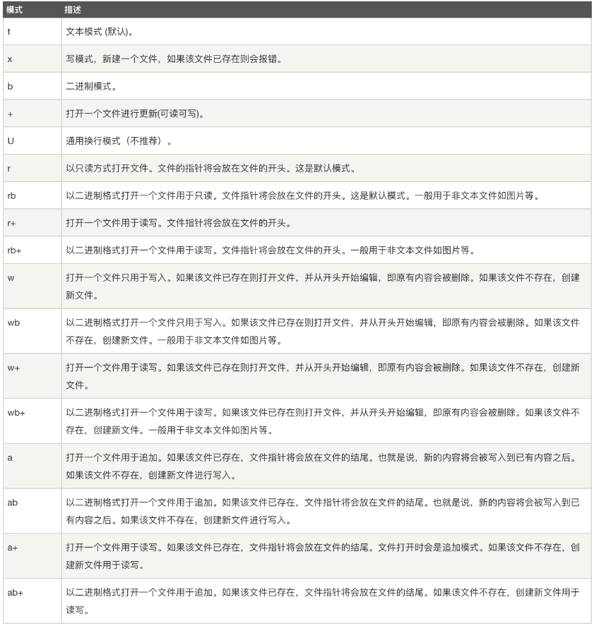


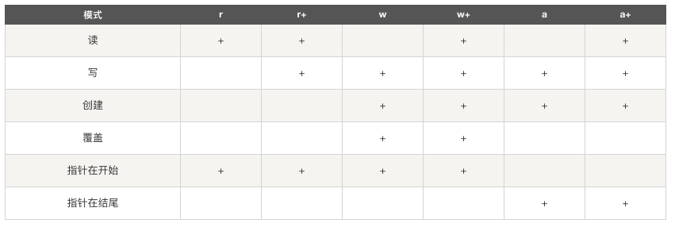

#### 10.2.2. File对象的属性

一个文件被打开后，你有一个file对象，你可以得到有关该文件的各种信息。  

file.closed 返回true如果文件已被关闭，否则返回false。  
file.mode 返回被打开文件的访问模式。  
file.name 返回文件的名称。  

#### 10.2.3. close()方法

File 对象的 close（）方法刷新缓冲区里任何还没写入的信息，并关闭该文件，这之后便不能再进行写入。  

当一个文件对象的引用被重新指定给另一个文件时，Python 会关闭之前的文件。用 close（）方法关闭文件是一个很好的习惯。  

语法：

```text
fileObject.close()
```

#### 10.2.4. write()方法

write()方法可将任何字符串写入一个打开的文件。需要重点注意的是，Python字符串可以是二进制数据，而不是仅仅是文字。  

write()方法不会在字符串的结尾添加换行符('\n')：  

语法：

```txt
fileObject.write(string)
```

#### 10.2.5. read()方法

read（）方法从一个打开的文件中读取一个字符串。需要重点注意的是，Python字符串可以是二进制数据，而不是仅仅是文字。  

语法：

```text
fileObject.read([count])
```

被传递的参数是要从已打开文件中读取的字节计数。该方法从文件的开头开始读入，如果没有传入count，它会尝试尽可能多地读取更多的内容，很可能是直到文件的末尾。  

#### 10.2.6. f.readline()

f.readline() 会从文件中读取单独的一行。换行符为 '\n'。f.readline() 如果返回一个空字符串, 说明已经已经读取到最后一行。

#### 10.2.7. f.readlines()

f.readlines() 将返回该文件中包含的所有行。  

如果设置可选参数 sizehint, 则读取指定长度的字节, 并且将这些字节按行分割。  

#### 10.2.8. f.tell()

f.tell() 返回文件对象当前所处的位置, 它是从文件开头开始算起的字节数。

#### 10.2.9. f.seek()

如果要改变文件当前的位置, 可以使用 f.seek(offset, from_what) 函数。  

from_what 的值, 如果是 0 表示开头, 如果是 1 表示当前位置, 2 表示文件的结尾，例如：  

seek(x,0) ： 从起始位置即文件首行首字符开始移动 x 个字符  
seek(x,1) ： 表示从当前位置往后移动x个字符  
seek(-x,2)： 表示从文件的结尾往前移动x个字符  

### 10.3. pickle 模块

python的pickle模块实现了基本的数据序列和反序列化。  

通过pickle模块的序列化操作我们能够将程序中运行的对象信息保存到文件中去，永久存储。  

通过pickle模块的反序列化操作，我们能够从文件中创建上一次程序保存的对象。  

基本接口：  

```text
pickle.dump(obj, file, [,protocol])  
```

## 11. File(文件) 方法

(demos/file)

### 11.1. open() 方法

用于打开一个文件，并返回文件对象，在对文件进行处理过程都需要使用到这个函数，如果该文件无法被打开，会抛出 OSError。  

> 注意：使用 open() 方法一定要保证关闭文件对象，即调用 close() 方法。  

open() 函数常用形式是接收两个参数：文件名(file)和模式(mode)。  

完整的语法格式为：  

```text
open(file, mode='r', buffering=-1, encoding=None, errors=None, newline=None, closefd=True, opener=None)  
```

参数说明:  

file: 必需，文件路径（相对或者绝对路径）。  
mode: 可选，文件打开模式  
buffering: 设置缓冲  
encoding: 一般使用utf8  
errors: 报错级别  
newline: 区分换行符  
closefd: 传入的file参数类型  
opener: 设置自定义开启器，开启器的返回值必须是一个打开的文件描述符。  

## 12. OS 文件/目录方法

os 模块提供了非常丰富的方法用来处理文件和目录。常用的方法如下表所示：

1. os.access(path, mode) 检验权限模式

2. os.chdir(path) 改变当前工作目录

3. os.chflags(path, flags) 设置路径的标记为数字标记。

4. os.chmod(path, mode) 更改权限

5. os.chown(path, uid, gid) 更改文件所有者

6. os.chroot(path) 改变当前进程的根目录

7. os.close(fd) 关闭文件描述符 fd

8. os.closerange(fd_low, fd_high) 关闭所有文件描述符，从 fd_low (包含) 到 fd_high (不包含), 错误会忽略

9. os.dup(fd) 复制文件描述符 fd

10. os.dup2(fd, fd2) 将一个文件描述符 fd 复制到另一个 fd2

11. os.fchdir(fd) 通过文件描述符改变当前工作目录

12. os.fchmod(fd, mode) 改变一个文件的访问权限，该文件由参数fd指定，参数mode是Unix下的文件访问权限。

13. os.fchown(fd, uid, gid) 修改一个文件的所有权，这个函数修改一个文件的用户ID和用户组ID，该文件由文件描述符fd指定。

14. os.fdatasync(fd) 强制将文件写入磁盘，该文件由文件描述符fd指定，但是不强制更新文件的状态信息。

15. os.fdopen(fd[, mode[, bufsize]])  通过文件描述符 fd 创建一个文件对象，并返回这个文件对象

16. os.fpathconf(fd, name) 返回一个打开的文件的系统配置信息。name为检索的系统配置的值，它也许是一个定义系统值的字符串，这些名字在很多标准中指定（POSIX.1, Unix 95, Unix 98, 和其它）。

17. os.fstat(fd) 返回文件描述符fd的状态，像stat()。

18. os.fstatvfs(fd) 返回包含文件描述符fd的文件的文件系统的信息，Python 3.3 相等于 statvfs()。

19. os.fsync(fd) 强制将文件描述符为fd的文件写入硬盘。

20. os.ftruncate(fd, length) 裁剪文件描述符fd对应的文件, 所以它最大不能超过文件大小。

21. os.getcwd() 返回当前工作目录

22. os.getcwdu() 返回一个当前工作目录的Unicode对象

23. os.isatty(fd) 如果文件描述符fd是打开的，同时与tty(-like)设备相连，则返回true, 否则False。

24. os.lchflags(path, flags) 设置路径的标记为数字标记，类似 chflags()，但是没有软链接

25. os.lchmod(path, mode) 修改连接文件权限

26. os.lchown(path, uid, gid) 更改文件所有者，类似 chown，但是不追踪链接。

27. os.link(src, dst) 创建硬链接，名为参数 dst，指向参数 src

28. os.listdir(path) 返回path指定的文件夹包含的文件或文件夹的名字的列表。

29. os.lseek(fd, pos, how) 设置文件描述符 fd当前位置为pos, how方式修改: SEEK_SET 或者 0 设置从文件开始的计算的pos; SEEK_CUR或者 1 则从当前位置计算; os.SEEK_END或者2则从文件尾部开始. 在unix，Windows中有效

30. os.lstat(path) 像stat(),但是没有软链接

31. os.major(device) 从原始的设备号中提取设备major号码 (使用stat中的st_dev或者st_rdev field)。

32. os.makedev(major, minor) 以major和minor设备号组成一个原始设备号

33. os.makedirs(path[, mode]) 递归文件夹创建函数。像mkdir(), 但创建的所有intermediate-level文件夹需要包含子文件夹。

34. os.minor(device) 从原始的设备号中提取设备minor号码 (使用stat中的st_dev或者st_rdev field )。

35. os.mkdir(path[, mode]) 以数字mode的mode创建一个名为path的文件夹.默认的 mode 是 0777 (八进制)。

36. os.mkfifo(path[, mode]) 创建命名管道，mode 为数字，默认为 0666 (八进制)

37. os.mknod(filename[, mode=0600, device]) 创建一个名为filename文件系统节点（文件，设备特别文件或者命名pipe）。

38. os.open(file, flags[, mode]) 打开一个文件，并且设置需要的打开选项，mode参数是可选的

39. os.openpty() 打开一个新的伪终端对。返回 pty 和 tty的文件描述符。

40. os.pathconf(path, name) 返回相关文件的系统配置信息。

41. os.pipe() 创建一个管道. 返回一对文件描述符(r, w) 分别为读和写

42. os.popen(command[, mode[, bufsize]]) 从一个 command 打开一个管道
43. os.read(fd, n) 从文件描述符 fd 中读取最多 n 个字节，返回包含读取字节的字符串，文件描述符 fd对应文件已达到结尾, 返回一个空字符串。
44. os.readlink(path) 返回软链接所指向的文件
45. os.remove(path) 删除路径为path的文件。如果path 是一个文件夹，将抛出OSError; 查看下面的rmdir()删除一个 directory。
46. os.removedirs(path) 递归删除目录。
47. os.rename(src, dst) 重命名文件或目录，从 src 到 dst
48. os.renames(old, new) 递归地对目录进行更名，也可以对文件进行更名。
49. os.rmdir(path) 删除path指定的空目录，如果目录非空，则抛出一个OSError异常。
50. os.stat(path) 获取path指定的路径的信息，功能等同于C API中的stat()系统调用。
51. os.stat_float_times([newvalue]) 决定stat_result是否以float对象显示时间戳

52. os.statvfs(path) 获取指定路径的文件系统统计信息
53. os.symlink(src, dst) 创建一个软链接
54. os.tcgetpgrp(fd) 返回与终端fd（一个由os.open()返回的打开的文件描述符）关联的进程组
55. os.tcsetpgrp(fd, pg) 设置与终端fd（一个由os.open()返回的打开的文件描述符）关联的进程组为pg。
56. os.tempnam([dir[, prefix]]) Python3 中已删除。返回唯一的路径名用于创建临时文件。
57. os.tmpfile() Python3 中已删除。返回一个打开的模式为(w+b)的文件对象 .这文件对象没有文件夹入口，没有文件描述符，将会自动删除。
58. os.tmpnam() Python3 中已删除。为创建一个临时文件返回一个唯一的路径
59. os.ttyname(fd) 返回一个字符串，它表示与文件描述符fd 关联的终端设备。如果fd 没有与终端设备关联，则引发一个异常。
60. os.unlink(path) 删除文件路径
61. os.utime(path, times) 返回指定的path文件的访问和修改的时间。
62. os.walk(top[, topdown=True[, onerror=None[, followlinks=False]]]) 输出在文件夹中的文件名通过在树中游走，向上或者向下。
63. os.write(fd, str)写入字符串到文件描述符 fd中. 返回实际写入的字符串长度
64. os.path 模块 获取文件的属性信息。
65. os.pardir() 获取当前目录的父目录，以字符串形式显示目录名。

## 13. 错误和异常

### 13.1. 语法错误

这个例子中，函数 print() 被检查到有错误，是它前面缺少了一个冒号 : 。  

语法分析器指出了出错的一行，并且在最先找到的错误的位置标记了一个小小的箭头。  

```text
>>> while True print('Hello world')
  File "<stdin>", line 1, in ?
    while True print('Hello world')
                   ^
SyntaxError: invalid syntax
```

### 13.2. 异常

异常以不同的类型出现，这些类型都作为信息的一部分打印出来: 例子中的类型有 ZeroDivisionError，NameError 和 TypeError。  

错误信息的前面部分显示了异常发生的上下文，并以调用栈的形式显示具体信息。  

```text
>>> 10 * (1/0)             # 0 不能作为除数，触发异常
Traceback (most recent call last):
  File "<stdin>", line 1, in ?
ZeroDivisionError: division by zero
>>> 4 + spam*3             # spam 未定义，触发异常
Traceback (most recent call last):
  File "<stdin>", line 1, in ?
NameError: name 'spam' is not defined
>>> '2' + 2               # int 不能与 str 相加，触发异常
Traceback (most recent call last):
  File "<stdin>", line 1, in <module>
TypeError: can only concatenate str (not "int") to str
```

### 13.3. 异常处理

#### 13.3.1. try/except

以下例子中，让用户输入一个合法的整数，但是允许用户中断这个程序（使用 Control-C 或者操作系统提供的方法）。用户中断的信息会引发一个 KeyboardInterrupt 异常。  

```py
while True:
    try:
        x = int(input("请输入一个数字: "))
        break
    except ValueError:
        print("您输入的不是数字，请再次尝试输入！")
```

try 语句按照如下方式工作；  

首先，执行 try 子句（在关键字 try 和关键字 except 之间的语句）。  

如果没有异常发生，忽略 except 子句，try 子句执行后结束。  

如果在执行 try 子句的过程中发生了异常，那么 try 子句余下的部分将被忽略。如果异常的类型和 except 之后的名称相符，那么对应的 except 子句将被执行。  

如果一个异常没有与任何的 except 匹配，那么这个异常将会传递给上层的 try 中。  

一个 try 语句可能包含多个except子句，分别来处理不同的特定的异常。最多只有一个分支会被执行。  

一个except子句可以同时处理多个异常，这些异常将被放在一个括号里成为一个元组，例如:

```py
except (RuntimeError, TypeError, NameError):
    pass
```

最后一个except子句可以忽略异常的名称，它将被当作通配符使用。你可以使用这种方法打印一个错误信息，然后再次把异常抛出。  

```py
import sys

try:
    f = open('myfile.txt')
    s = f.readline()
    i = int(s.strip())
except OSError as err:
    print("OS error: {0}".format(err))
except ValueError:
    print("Could not convert data to an integer.")
except:
    print("Unexpected error:", sys.exc_info()[0])
    raise
```

#### 13.3.2. try/except...else

try/except 语句还有一个可选的 else 子句，如果使用这个子句，那么必须放在所有的 except 子句之后。  

else 子句将在 try 子句没有发生任何异常的时候执行。  

以下实例在 try 语句中判断文件是否可以打开，如果打开文件时正常的没有发生异常则执行 else 部分的语句，读取文件内容：

```py
for arg in sys.argv[1:]:
    try:
        f = open(arg, 'r')
    except IOError:
        print('cannot open', arg)
    else:
        print(arg, 'has', len(f.readlines()), 'lines')
        f.close()
```

使用 else 子句比把所有的语句都放在 try 子句里面要好，这样可以避免一些意想不到，而 except 又无法捕获的异常。  

异常处理并不仅仅处理那些直接发生在 try 子句中的异常，而且还能处理子句中调用的函数（甚至间接调用的函数）里抛出的异常。例如:

```py
>>> def this_fails():
        x = 1/0
   
>>> try:
        this_fails()
    except ZeroDivisionError as err:
        print('Handling run-time error:', err)
   
Handling run-time error: int division or modulo by zero
```

#### 13.3.3. try-finally 语句

try-finally 语句无论是否发生异常都将执行最后的代码。  

以下实例中 finally 语句无论异常是否发生都会执行：

```py
try:
    runoob()
except AssertionError as error:
    print(error)
else:
    try:
        with open('file.log') as file:
            read_data = file.read()
    except FileNotFoundError as fnf_error:
        print(fnf_error)
finally:
    print('这句话，无论异常是否发生都会执行。')
```

### 13.4. 抛出异常

Python 使用 raise 语句抛出一个指定的异常。  

raise语法格式如下：

```py
raise [Exception [, args [, traceback]]]
```

以下实例如果 x 大于 5 就触发异常:

```py
x = 10
if x > 5:
    raise Exception('x 不能大于 5。x 的值为: {}'.format(x))
```

### 13.5. 用户自定义异常

通过创建一个新的异常类来拥有自己的异常。异常类继承自 Exception 类，可以直接继承，或者间接继承，例如:

```py
class Error(Exception):
    """Base class for exceptions in this module."""
    pass

class InputError(Error):
    """Exception raised for errors in the input.

    Attributes:
        expression -- input expression in which the error occurred
        message -- explanation of the error
    """

    def __init__(self, expression, message):
        self.expression = expression
        self.message = message

class TransitionError(Error):
    """Raised when an operation attempts a state transition that's not
    allowed.

    Attributes:
        previous -- state at beginning of transition
        next -- attempted new state
        message -- explanation of why the specific transition is not allowed
    """

    def __init__(self, previous, next, message):
        self.previous = previous
        self.next = next
        self.message = message
```

### 13.6. 定义清理行为

try 语句还有另外一个可选的子句，它定义了无论在任何情况下都会执行的清理行为。 例如:  

```py
try:
   raise KeyboardInterrupt
finally:
   print('Goodbye, world!')
```

如果一个异常在 try 子句里（或者在 except 和 else 子句里）被抛出，而又没有任何的 except 把它截住，那么这个异常会在 finally 子句执行后被抛出。  

在同一个 try 语句里包含 except 和 finally 子句:  

```py
def divide(x, y):
        try:
            result = x / y
        except ZeroDivisionError:
            print("division by zero!")
        else:
            print("result is", result)
        finally:
            print("executing finally clause")
```

### 13.7. 预定义的清理行为

关键词 with 语句就可以保证诸如文件之类的对象在使用完之后一定会正确的执行他的清理方法:

```py
with open("myfile.txt") as f:
    for line in f:
        print(line, end="")
```

## 14. 面向对象

### 14.1. 类定义

语法格式如下：

```text
class ClassName:
    <statement-1>
    .
    .
    .
    <statement-N>
```

### 14.2. 类对象

(demos/class/demo1.py)

类对象支持两种操作：属性引用和实例化。  

属性引用使用和 Python 中所有的属性引用一样的标准语法：obj.name。  

类对象创建后，类命名空间中所有的命名都是有效属性名。所以如果类定义是这样:  

```py
class MyClass:
    """一个简单的类实例"""
    i = 12345

    def f(self):
        return 'hello world'


# 实例化类
x = MyClass()

# 访问类的属性和方法
print("MyClass 类的属性 i 为：", x.i)
print("MyClass 类的方法 f 输出为：", x.f())
```

类有一个名为 __init__() 的特殊方法（构造方法），该方法在类实例化时会自动调用，像下面这样：  

```py
def __init__(self):
    self.data = []
```

#### 14.2.1. self代表类的实例，而非类

(demos/class/demo3.py)

类的方法与普通的函数只有一个特别的区别——它们必须有一个额外的第一个参数名称, 按照惯例它的名称是 self。  

```py
class Test:
    def prt(self):
        print(self)
        print(self.__class__)


t = Test()
t.prt()

# 同上
# class Test:
#     def prt(runoob):
#         print(runoob)
#         print(runoob.__class__)

# t = Test()
# t.prt()
```

self 代表的是类的实例，代表当前对象的地址，而 self.class 则指向类。

### 14.3. 类的方法

(demos/class/demo4.py)

在类的内部，使用 def 关键字来定义一个方法，与一般函数定义不同，类方法必须包含参数 self, 且为第一个参数，self 代表的是类的实例。

```py
#类定义
class people:
    #定义基本属性
    name = ''
    age = 0
    #定义私有属性,私有属性在类外部无法直接进行访问
    __weight = 0
    #定义构造方法
    def __init__(self,n,a,w):
        self.name = n
        self.age = a
        self.__weight = w
    def speak(self):
        print("%s 说: 我 %d 岁。" %(self.name,self.age))
 
# 实例化类
p = people('runoob',10,30)
p.speak()
```

### 14.4. 继承

(demos/class/demo5.py)  

派生类的定义如下所示:

```text
class DerivedClassName(BaseClassName1):
    <statement-1>
    .
    .
    .
    <statement-N>
```

BaseClassName（示例中的基类名）必须与派生类定义在一个作用域内。除了类，还可以用表达式，基类定义在另一个模块中时这一点非常有用:  

class DerivedClassName(modname.BaseClassName):  

### 14.5. 多继承

多继承的类定义形如下例:

```text
class DerivedClassName(Base1, Base2, Base3):
    <statement-1>
    .
    .
    .
    <statement-N>
```

### 14.6. 方法重写

子类重写你父类的方法，实例如下：

```py
class Parent:        # 定义父类
   def myMethod(self):
      print ('调用父类方法')
 
class Child(Parent): # 定义子类
   def myMethod(self):
      print ('调用子类方法')
 
c = Child()          # 子类实例
c.myMethod()         # 子类调用重写方法
super(Child,c).myMethod() #用子类对象调用父类已被覆盖的方法
```

### 14.7. 类属性与方法

(demos/class/demo6.py)  

#### 14.7.1. 类的私有属性

__private_attrs：两个下划线开头，声明该属性为私有，不能在类的外部被使用或直接访问。在类内部的方法中使用时 self.__private_attrs。  

#### 14.7.2. 类的方法

在类的内部，使用 def 关键字来定义一个方法，与一般函数定义不同，类方法必须包含参数 self，且为第一个参数，self 代表的是类的实例。  

self 的名字并不是规定死的，也可以使用 this，但是最好还是按照约定是用 self。  

#### 14.7.3. 类的私有方法

__private_method：两个下划线开头，声明该方法为私有方法，只能在类的内部调用 ，不能在类的外部调用。self.__private_methods

```py
class JustCounter:
    __secretCount = 0  # 私有变量
    publicCount = 0    # 公开变量
 
    def count(self):
        self.__secretCount += 1
        self.publicCount += 1
        print (self.__secretCount)
 
counter = JustCounter()
counter.count()
counter.count()
print (counter.publicCount)
print (counter.__secretCount)  # 报错，实例不能访问私有变量
```

类的专有方法：  
__init__ : 构造函数，在生成对象时调用  
__del__ : 析构函数，释放对象时使用  
__repr__ : 打印，转换  
__setitem__ : 按照索引赋值  
__getitem__: 按照索引获取值  
__len__: 获得长度  
__cmp__: 比较运算  
__call__: 函数调用  
__add__: 加运算  
__sub__: 减运算  
__mul__: 乘运算  
__truediv__: 除运算  
__mod__: 求余运算  
__pow__: 乘方  

### 14.8. 运算符重载

可以对类的专有方法进行重载，实例如下：

```py
class Vector:
   def __init__(self, a, b):
      self.a = a
      self.b = b
 
   def __str__(self):
      return 'Vector (%d, %d)' % (self.a, self.b)
   
   def __add__(self,other):
      return Vector(self.a + other.a, self.b + other.b)
 
v1 = Vector(2,10)
v2 = Vector(5,-2)
print (v1 + v2)
```

## 15. 命名空间和作用域

### 15.1. 命名空间

命名空间提供了在项目中避免名字冲突的一种方法。各个命名空间是独立的，没有任何关系的，所以一个命名空间中不能有重名，但不同的命名空间是可以重名而没有任何影响。  

一般有三种命名空间：

- 内置名称（built-in names）， Python 语言内置的名称，比如函数名 abs、char 和异常名称 BaseException、Exception 等等。
- 全局名称（global names），模块中定义的名称，记录了模块的变量，包括函数、类、其它导入的模块、模块级的变量和常量。
- 局部名称（local names），函数中定义的名称，记录了函数的变量，包括函数的参数和局部定义的变量。（类中定义的也是）

命名空间查找顺序:  
假设我们要使用变量 runoob，则 Python 的查找顺序为：局部的命名空间去 -> 全局命名空间 -> 内置命名空间。  
如果找不到变量 runoob，它将放弃查找并引发一个 NameError 异常:  NameError: name 'runoob' is not defined。  

命名空间的生命周期取决于对象的作用域，如果对象执行完成，则该命名空间的生命周期就结束。  

### 15.2. 作用域

(demos/scope/demo1.py)  

在一个 python 程序中，直接访问一个变量，会从内到外依次访问所有的作用域直到找到，否则会报未定义的错误。  

变量的作用域决定了在哪一部分程序可以访问哪个特定的变量名称。Python的作用域一共有4种，分别是：  

- L（Local）：最内层，包含局部变量，比如一个函数/方法内部。
- E（Enclosing）：包含了非局部(non-local)也非全局(non-global)的变量。比如两个嵌套函数，一个函数（或类） A 里面又包含了一个函数 B ，那么对于 B 中的名称来说 A 中的作用域就为 nonlocal。
- G（Global）：当前脚本的最外层，比如当前模块的全局变量。
- B（Built-in）： 包含了内建的变量/关键字等。，最后被搜索  

规则顺序： L –> E –> G –> B。  

内置作用域是通过一个名为 builtin 的标准模块来实现的，但是这个变量名自身并没有放入内置作用域内，所以必须导入这个文件才能够使用它。在Python3.0中，可以使用以下的代码来查看到底预定义了哪些变量:  

```py
import builtins
dir(builtins)
```

Python 中只有模块（module），类（class）以及函数（def、lambda）才会引入新的作用域，其它的代码块（如 if/elif/else/、try/except、for/while等）是不会引入新的作用域的，也就是说这些语句内定义的变量，外部也可以访问.  

### 15.3. 全局变量和局部变量

(demos/scope/demo2.py)  

定义在函数内部的变量拥有一个局部作用域，定义在函数外的拥有全局作用域。  

局部变量只能在其被声明的函数内部访问，而全局变量可以在整个程序范围内访问。调用函数时，所有在函数内声明的变量名称都将被加入到作用域中。  

```py
total = 0  # 这是一个全局变量

# 可写函数说明
def sum(arg1, arg2):
    #返回2个参数的和."
    total = arg1 + arg2  # total在这里是局部变量.
    print("函数内是局部变量 : ", total) # 30
    return total

#调用sum函数
sum(10, 20)
print("函数外是全局变量 : ", total) # 0

```

### 15.4. global 和 nonlocal关键字

(demos/scope/demo3.py)  

当内部作用域想修改外部作用域的变量时，就要用到global和nonlocal关键字了。

```py
num = 1

def fun1():
    global num  # 需要使用 global 关键字声明
    print(num) # 1
    num = 123
    print(num) # 123

fun1()
print(num) # 123
```

如果要修改嵌套作用域（enclosing 作用域，外层非全局作用域）中的变量则需要 nonlocal 关键字了

```py
def outer():
    num = 10
    def inner():
        nonlocal num  # nonlocal关键字声明
        num = 100
        print(num) # 100

    inner()
    print(num) # 100

outer()
```

## 16. Python3 标准库概览

### 16.1. 操作系统接口

(demos/library/demo1.py)

os模块提供了不少与操作系统相关联的函数。

```py
import os
print(os.getcwd())  # 返回当前的工作目录
```

### 16.2. 文件通配符

(demos/library/demo2.py)  

glob模块提供了一个函数用于从目录通配符搜索中生成文件列表:

```py
import glob
print(glob.glob('*.py'))  #  ?? []
```

### 16.3. 命令行参数

通用工具脚本经常调用命令行参数。这些命令行参数以链表形式存储于 sys 模块的 argv 变量。例如在命令行中执行 "python demo.py one two three" 后可以得到以下输出结果:

```py
>>> import sys
>>> print(sys.argv)
['demo.py', 'one', 'two', 'three']
```

### 16.4. 错误输出重定向和程序终止

sys 还有 stdin，stdout 和 stderr 属性，即使在 stdout 被重定向时，后者也可以用于显示警告和错误信息。

```py
>>> sys.stderr.write('Warning, log file not found starting a new one\n')
Warning, log file not found starting a new one
```

### 16.5. 访问互联网

(demos/library/demo3.py)  

有几个模块用于访问互联网以及处理网络通信协议。其中最简单的两个是用于处理从 urls 接收的数据的 urllib.request 以及用于发送电子邮件的 smtplib.

### 16.6. 数据压缩

以下模块直接支持通用的数据打包和压缩格式：zlib，gzip，bz2，zipfile，以及 tarfile。

```py
>>> import zlib
>>> s = b'witch which has which witches wrist watch'
>>> len(s)
41
>>> t = zlib.compress(s)
>>> len(t)
37
>>> zlib.decompress(t)
b'witch which has which witches wrist watch'
>>> zlib.crc32(s)
226805979
```

### 16.7. 性能度量

```py
>>> from timeit import Timer
>>> Timer('t=a; a=b; b=t', 'a=1; b=2').timeit()
0.57535828626024577
>>> Timer('a,b = b,a', 'a=1; b=2').timeit()
0.54962537085770791
```

### 16.8. 测试模块

doctest模块提供了一个工具，扫描模块并根据程序中内嵌的文档字符串执行测试。  

```py
def average(values):
    """Computes the arithmetic mean of a list of numbers.

    >>> print(average([20, 30, 70]))
    40.0
    """
    return sum(values) / len(values)

import doctest
doctest.testmod()   # 自动验证嵌入测试
```

## 17. 正则表达式

re 模块使 Python 语言拥有全部的正则表达式功能。  

compile 函数根据一个模式字符串和可选的标志参数生成一个正则表达式对象。该对象拥有一系列方法用于正则表达式匹配和替换。  

### 17.1. re.match函数

(demos/regExp/demo1.py)  

re.match 尝试从字符串的起始位置匹配一个模式，如果不是起始位置匹配成功的话，match()就返回none。  

函数语法：

```py
re.match(pattern, string, flags=0)
```

pattern  匹配的正则表达式。  
string   要匹配的字符串。  
flags    标志位，用于控制正则表达式的匹配方式，如：是否区分大小写，多行匹配等等。  

匹配成功re.match方法返回一个匹配的对象，否则返回None。  

```py
import re
print(re.match('www', 'www.baidu.com').span())  # 在起始位置匹配    (0, 3)
print(re.match('com', 'www.baidu.com'))  # 不在起始位置匹配          None
```

可以使用group(num) 或 groups() 匹配对象函数来获取匹配表达式。  

group(num=0)   匹配的整个表达式的字符串，group() 可以一次输入多个组号，在这种情况下它将返回一个包含那些组所对应值的元组。  
groups()       返回一个包含所有小组字符串的元组，从 1 到 所含的小组号。  

```py
line = "Cats are smarter than dogs"
# .* 表示任意匹配除换行符（\n、\r）之外的任何单个或多个字符
matchObj = re.match(r'(.*) are (.*?) .*', line, re.M | re.I)

if matchObj:
    print("matchObj.group() : ", matchObj.group()) # Cats are smarter than dogs
    print("matchObj.group(1) : ", matchObj.group(1)) # Cats
    print("matchObj.group(2) : ", matchObj.group(2)) # smarter
else:
    print("No match!!")
```

### 17.2. re.search方法

(demos/regExp/demo2.py)  

re.search 扫描整个字符串并返回第一个成功的匹配。  

函数语法：

```py
re.search(pattern, string, flags=0)
```

```py
import re

print(re.search('www', 'www.baidu.com').span())  # 在起始位置匹配 (0, 3)
print(re.search('com', 'www.baidu.com').span())  # 不在起始位置匹配 (10, 13)
```

可以使用group(num) 或 groups() 匹配对象函数来获取匹配表达式。  

```py
line = "Cats are smarter than dogs"

searchObj = re.search(r'(.*) are (.*?) .*', line, re.M | re.I)

if searchObj:
    print("searchObj.group() : ", searchObj.group())  # Cats are smarter than dogs
    print("searchObj.group(1) : ", searchObj.group(1)) # Cats
    print("searchObj.group(2) : ", searchObj.group(2)) # Cats
else:
    print("Nothing found!!")
```

### 17.3. 检索和替换

(demos/regExp/demo3.py)  

re.sub用于替换字符串中的匹配项。  

```py
re.sub(pattern, repl, string, count=0, flags=0)
```

参数：  

1. pattern : 正则中的模式字符串。  
2. repl : 替换的字符串，也可为一个函数。  
3. string : 要被查找替换的原始字符串。  
4. count : 模式匹配后替换的最大次数，默认 0 表示替换所有的匹配。  
5. flags : 编译时用的匹配模式，数字形式。  

前三个为必选参数，后两个为可选参数。  

```py
import re

phone = "2004-959-559 # 这是一个电话号码"

# 删除注释
num = re.sub(r'#.*$', "", phone)
print("电话号码 : ", num)   # 2004-959-559 

# 移除非数字的内容
num = re.sub(r'\D', "", phone)
print("电话号码 : ", num)  # 2004959559
```

### 17.4. compile 函数

(demos/regExp/demo4.py)  

compile 函数用于编译正则表达式，生成一个正则表达式（ Pattern ）对象，供 match() 和 search() 这两个函数使用。  

语法格式为：

```py
re.compile(pattern[, flags])
```

参数：  

- pattern : 一个字符串形式的正则表达式  
- flags 可选，表示匹配模式，比如忽略大小写，多行模式等，具体参数为：  
- re.I 忽略大小写  
    re.L 表示特殊字符集 \w, \W, \b, \B, \s, \S 依赖于当前环境  
    re.M 多行模式  
    re.S 即为' . '并且包括换行符在内的任意字符（' . '不包括换行符）  
    re.U 表示特殊字符集 \w, \W, \b, \B, \d, \D, \s, \S 依赖于 Unicode 字符属性数据库  
    re.X 为了增加可读性，忽略空格和' # '后面的注释  

```py
import re
pattern = re.compile(r'\d+')  # 用于匹配至少一个数字
m = pattern.match('one12twothree34four')  # 查找头部，没有匹配
print(m) # None
m = pattern.match('one12twothree34four', 2, 10)  # 从'e'的位置开始匹配，没有匹配
print(m) # None

m = pattern.match('one12twothree34four', 3, 10)  # 从'1'的位置开始匹配，正好匹配
print(m)  # 返回一个 Match 对象 <re.Match object; span=(3, 5), match='12'>
m.group(0)  # 可省略 0
m.start(0)  # 可省略 0
m.end(0)  # 可省略 0
m.span(0)  # 可省略 0
```

在上面，当匹配成功时返回一个 Match 对象，其中：  

group([group1, …]) 方法用于获得一个或多个分组匹配的字符串，当要获得整个匹配的子串时，可直接使用 group() 或 group(0)；  
start([group]) 方法用于获取分组匹配的子串在整个字符串中的起始位置（子串第一个字符的索引），参数默认值为 0；  
end([group]) 方法用于获取分组匹配的子串在整个字符串中的结束位置（子串最后一个字符的索引+1），参数默认值为 0；  
span([group]) 方法返回 (start(group), end(group))。  

### 17.5. findall

(demos/regExp/demo5.py)  

在字符串中找到正则表达式所匹配的所有子串，并返回一个列表，如果没有找到匹配的，则返回空列表。  

注意： match 和 search 是匹配一次 findall 匹配所有。  

语法格式为：  

```text
re.findall(pattern, string, flags=0)
或
pattern.findall(string[, pos[, endpos]])
```

参数：  

pattern 匹配模式。  
string 待匹配的字符串。  
pos 可选参数，指定字符串的起始位置，默认为 0。  
endpos 可选参数，指定字符串的结束位置，默认为字符串的长度。  

```py
import re

result1 = re.findall(r'\d+', 'baidu 123 google 456')

pattern = re.compile(r'\d+')  # 查找数字
result2 = pattern.findall('baidu 123 google 456')
result3 = pattern.findall('bai88du123google456', 0, 10)

print(result1) # ['123', '456']
print(result2) # ['123', '456']
print(result3) # ['88', '123']
```

### 17.6. re.finditer

和 findall 类似，在字符串中找到正则表达式所匹配的所有子串，并把它们作为一个迭代器返回。  

re.finditer(pattern, string, flags=0)  

参数：  
pattern 匹配的正则表达式  
string  要匹配的字符串。  
flags   标志位，用于控制正则表达式的匹配方式，如：是否区分大小写，多行匹配等等。  

```py
it = re.finditer(r"\d+", "12a32bc43jf3")
for match in it:
    print(match.group())
# 12
# 32
# 43
# 3
```

### 17.7. re.split

split 方法按照能够匹配的子串将字符串分割后返回列表，它的使用形式如下：

```text
re.split(pattern, string[, maxsplit=0, flags=0])
```

pattern  匹配的正则表达式.  
string   要匹配的字符串。  
maxsplit 分隔次数，maxsplit=1 分隔一次，默认为 0，不限制次数。  
flags    标志位，用于控制正则表达式的匹配方式，如：是否区分大小写，多行匹配等等。  

### 17.8. 正则表达式修饰符 - 可选标志

正则表达式可以包含一些可选标志修饰符来控制匹配的模式。修饰符被指定为一个可选的标志。多个标志可以通过按位 OR(|) 它们来指定。如 re.I | re.M 被设置成 I 和 M 标志：  

re.I  使匹配对大小写不敏感  
re.L  做本地化识别（locale-aware）匹配  
re.M  多行匹配，影响 ^ 和 $  
re.S  使 . 匹配包括换行在内的所有字符  
re.U  根据Unicode字符集解析字符。这个标志影响 \w, \W, \b, \B.  
re.X  该标志通过给予你更灵活的格式以便你将正则表达式写得更易于理解。  

### 17.9. 正则表达式模式

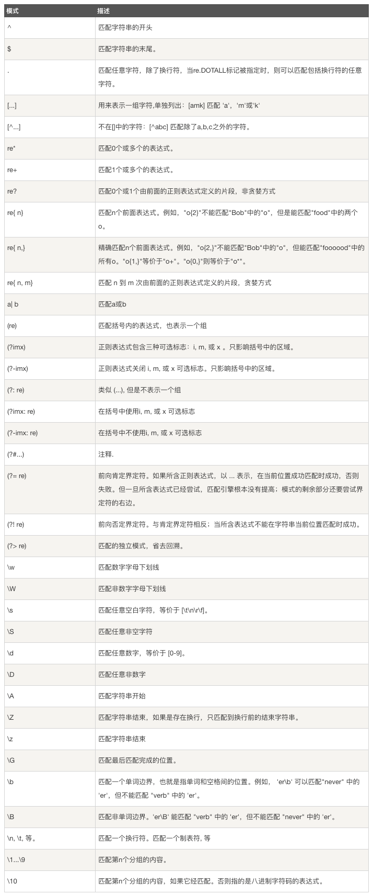

## 18.CGI编程

CGI(Common Gateway Interface),通用网关接口,它是一段程序,运行在服务器上如：HTTP服务器，提供同客户端HTML页面的接口.  


